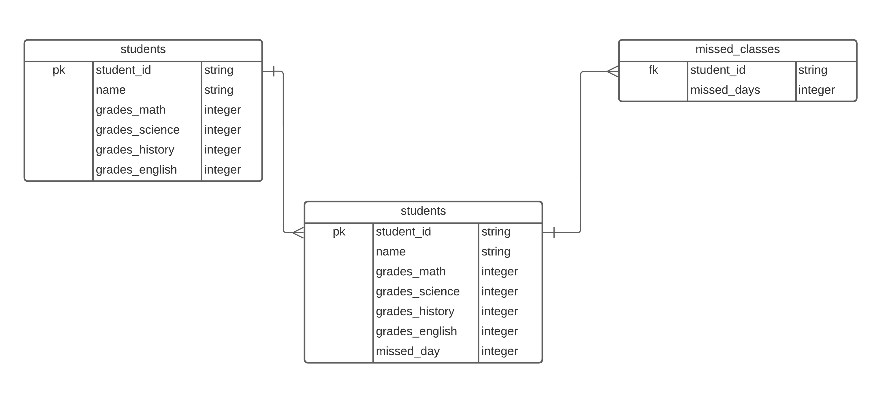
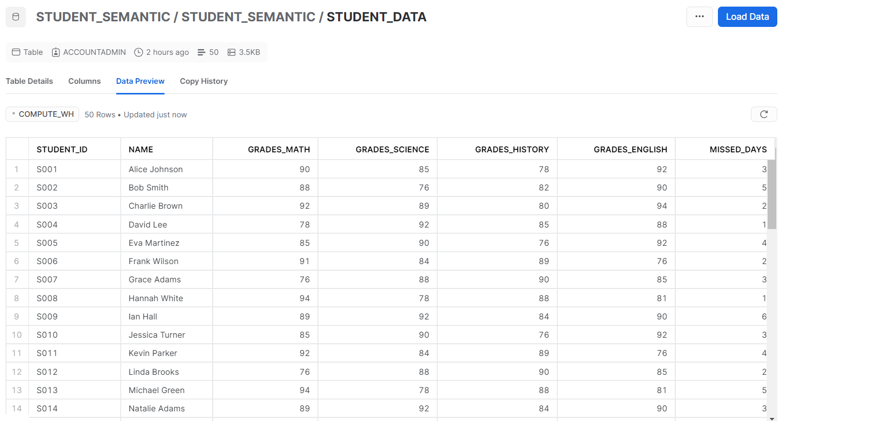

# Student Data Analysis
---
## Case Study
To undestand the students performance, the customer experience of a paid school asked the data team some data to analyse how the students have been performing since last quarter. To accomplish that, some business questions were formed so that one could measure students performance.

The goal here is to discover the students who needs help, design a solution so that we could avoid churn and calculate the amount of money that keeping them will provide.

## Questions
1. What's the overall avarage per subject?
2. What's the overall avarage per student?
3. What percent of students have grades higher than 70?
4. Is there any relationship between number of absences and final grade?
5. Do students who miss more than 5 days tends to have lower grades?

*Attention: These questions are answered in the notebook of this project called student_analysis*

## Overview of the Dataset

|**Feature**|**Description**| **Type** | **Missing Values?** | 
|---------|------------|-------------|-------------|
|student_id	| Unique identifier for a student| String| No missing values in this feature|
|name	| Student name| String| No missing values in this feature|
|grades_math	| The mean grade value of math in the last 3 months | Integer| No missing values in this feature|
|grades_science	| The mean grade value of science in the last 3 months| Integer| No missing values in this feature|
|grades_history	| The mean grade value of history in the last 3 months| Integer| No missing values in this feature|
|grades_english	| The mean grade value of english in the last 3 months| Integer| No missing values in this feature|
|missed_days	| The mean missed days value of the student in the last 3 months| integer| No missing values in this feature|

# How data was obtained

The **workflow** to obtain the data was defined as shown in Fig. 1. A python script was built to read json files and build a pandas dataframe from them. Next, the data was pushed in snowflake so that business could perform the analysis.

**Fig. 1**

The **relatioship** between students and missed_classes is described in Fig.2. students and missed_classes have a 1:1 relationship and joining  students and missed_classes a One Big Table was built.

**Fig.2**

The final table in Snowflake has the shape shown in Fig.3

**Fig.3**

## The Infrastructure

The workflow is inside the airflow:2.7.1 as shown in the Dockerfile with Python3.8

~~~Docker
FROM apache/airflow:2.7.1
COPY requirements.txt .

ENV PYTHON_VERSION=3.8
ENV CONSTRAINT_URL="https://raw.githubusercontent.com/apache/airflow/constraints-${AIRFLOW_VERSION}/constraints-${PYTHON_VERSION}.txt"
RUN pip install --no-cache-dir "apache-airflow==${AIRFLOW_VERSION}" --constraint ${CONSTRAINT_URL} -r requirements.txt
~~~

# Dag folder organization
In order to organize the dags, a folder called "package" were created to represent UDF that transforms the data. student_semantic is related to student_semantic dag, so each dag will have its own UDF folder to organize project code

~~~bash
├── dags
│   ├── __pycache__
│   │   └── student_semantic.cpython-38.pyc
│   ├── packages
│   │   └── student_semantic
│   │       └── student_semantic.py
│   └── student_semantic.py
~~~

